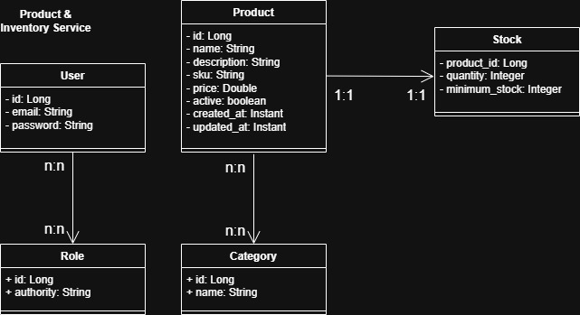

---

# 👤 Product & Inventory Service API
### Inventory Management Microservice (Active Development)

Este microsserviço é o segundo microsserviço do ecossistema de e-commerce, focado na gestão de produtos e controle rigoroso de estoque. O projeto foca na aplicação de conceitos práticos de backend, como integridade de dados, regras de negócio e arquitetura escalável.

---

## 🧭 Visão Geral da Arquitetura



---

## 📐 Arquitetura e Modelagem
O projeto foi desenvolvido com foco em escalabilidade e manutenção, utilizando padrões de mercado:

* **Modelagem de Dados:** Relacionamentos complexos $N:N$ para Perfis (Roles), $N:N$ para detalhes de produtos e categoria e $1:1$ em produtos e estoque
* **Projeções (Spring Data JPA):** Otimização de consultas ao banco de dados, buscando apenas os campos necessários através de interfaces de projeção.
* **Handlers de Exceção:** Tratamento global de erros através de um `@ControllerAdvice`, garantindo respostas HTTP padronizadas e seguras.
* **DTOs (Data Transfer Objects):** Camada de transporte de dados para isolar a lógica de negócio das entidades de persistência.

---

## 🛠️ Tecnologias e Ferramentas
* **Linguagem:** Java 21 
* **Framework:** Spring Boot 3, Spring Data JPA, Spring Security 
* **Segurança:** Autenticação e autorização com JWT (OAuth2) 
* **Banco de Dados:** PostgreSQL (Produção/Dev) e H2 (Testes) 
* **APIs:** REST, Swagger/OpenAPI 
* **Testes:** JUnit 5, Mockito 
* **Build:** Maven 

---

## 🧪 Qualidade de Software (Em desenvolvimento)
A cobertura de testes está sendo ativamente desenvolvida para garantir confiabilidade e facilidade de manutenção.

* **Testes de Integração (Fluxo Controlador → Banco de Dados)** 
* **Testes Unitários usando Mockito** 
* **Fábricas de Dados de Teste para cenários reutilizáveis** 

---

## 📂 Documentação e Testes Manuais
Para facilitar a exploração da API, o projeto inclui:
* **Diagramas:** Modelagem de Entidade e Classe detalhada (disponível em `src/main/java/com.r../docs/diagrams`).
* **Postman:** Collection e Environment prontos para importar e testar os endpoints imediatamente.
* **Swagger:** Documentação interativa disponível via UI ao rodar a aplicação. 
  
  * Swagger UI
    👉 http://localhost:8080/swagger-ui/index.html

  * OpenAPI JSON
    👉 http://localhost:8080/v3/api-docs

---

---

## 🔐 Autenticação (JWT)

Esta API utiliza autenticação baseada em **JWT (Bearer Token)** para proteger os endpoints.

### 📌 Como obter o token

1. Realize a autenticação no endpoint `/login`
2. Copie o token JWT retornado na resposta

### 📌 Como utilizar no Swagger

1. Clique no botão **Authorize** no Swagger UI
2. Insira o token no formato:

```
Bearer seu_token_aqui
```

3. Clique em **Authorize**
4. Agora você pode acessar os endpoints protegidos

### 🔒 Endpoints protegidos

Todos os endpoints exigem autenticação, exceto os responsáveis por login/autenticação.

### 📥 Exemplo de resposta do login

```json
{
  "token": "eyJhbGciOiJIUzI1NiIsInR5cCI6IkpXVCJ9..."
}
```

---

## 🚀 Endpoints
Alguns endpoints principais da API estão listados abaixo. Para a documentação completa, consulte o Swagger.

Para a documentação completa, acesse o Swagger:
👉 http://localhost:8080/swagger-ui.html


| Endpoint                                 | Método | Descrição                                     |
|------------------------------------------|--------|-----------------------------------------------|
| `/products`                              | GET    | Lista todos os produtos<br                    |
| `/products/{id}`                         | GET    | Busca produto por id<br                       |
| `/products/sku?sku={sku}`                | GET    | Busca produto pelo seu codigo<br              |
| `/products/active?active={boolean}`      | GET    | Lista todos os produtos ativos ou não<br      |
| `/products/category?category={category}` | GET    | Lista todos os produtos pela sua categoria<br |
| `/products/name?name={name}`             | GET    | Busca produto por nome<br                     |
| `/login`                                 | POST | Gera token JWT                           |

### Exemplo de GET `/products`

```json
[
  {
    "id": 1,
    "name": "Processador i5-12400f",
    "description": "Processador de 12ª geração popular, com 6 núcleos e 12 threads (2.5GHz até 4.4GHz Turbo), ideal para jogos e custo-benefício",
    "sku": "A001-P001",
    "price": 699.0,
    "active": true,
    "categories": [
      {
        "id": 3,
        "name": "Componentes"
      }
    ]
  }
]
```
---
## ▶️ Executando o Projeto

### Requisitos
- Java 21+
- Maven
- PostgreSQL

### Passos

```bash
git clone https://github.com/romulomotadev/portifolio-spring-02-product-inventory-service-api.git
cd product-inventory-service
mvn clean install
mvn spring-boot:run
```
---

## 🚀 Próximos Passos
Este projeto é o segundo de um ecossistema de quatro microsserviços voltados para o portfólio profissional:
1. **User Service:** Gestão de Usuários e Autenticação.
2. **Product & Inventory Service:** Gestão de estoque e catálogo.
3. **Order Service:** Orquestração de pedidos com integração entre serviços e mensageria (RabbitMQ) - (Em desenvolvimento).
4. **Infraestrutura:** Conteinerização com **Docker**, monitoramento com **Prometheus/Grafana** e deploy via **AWS**. (Em breve)

---

### 👨‍💻 Autor
**Rômulo Mota** - Desenvolvedor Java Backend em transição de carreira.
* [LinkedIn](https://linkedin.com/in/romulomotadev)
* [GitHub](https://github.com/romulomotadev)